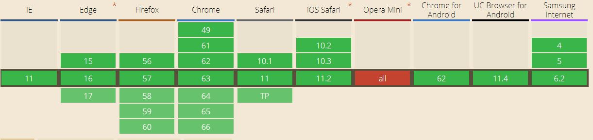

# CSS3动画 分析总结
## 0 注意事项

#### 注意：时间设置有要求，大致如下
**第一个时间是持续时长，第二个参数是等待时间**

 - 持续时长，等待时长 有顺序 <br >
 - 只写一个时，只有持续时长，等待时长为空 <br >
 - 写入无位置限制 ，可以和其他属性值交叉写 <br >
 - 不能超过2个时间点 ，否则报错失效 <br >


## 1 Transition 
### 1.1 动画执行方式
css3引入Transition（过渡），css3没有时间轴，装填变化是及时发生的。
在样式中添加，对应的指定的属性，然后对这个属性进行过渡。

* 例如：
```
img {
    height: 100px;
    width: 100px;
    transition: 1s height;
}

img:hover {
    height: 1000px;
    width: 1000px;
}

<!-- 延迟1s后执行下一个过渡 -->

img {
    transition: 1s height, 1s 1s width ease;
}
<!-- 设置变化的速度 -->

transition-timing-function
参数：
    linear:       线性匀速
    ease-in：     加速
    ease-out：    减速
    ease-in-out： 先加速后减速
    cubic-bezier: 自定义速度曲线

<!-- 完整写法 -->

img {
    transition-property: height;       //目标属性
    transition-duration: 1s;           //动画周期
    transition-delay: 1s;              //动画延迟
    transition-timing-function: ease;  //执行速度模式
}

  .transition-forever {                  //hover离开时触发新动画并设置一个很大的延迟时间
    display: block;
    transition: .5s 999999s;
    width: 100px;
    height: auto;
    &:hover {
      width: 50px;
      height: auto;
      transition: .5s width ease-in-out .5s;  //transition未必写在触发事件的外面，满足transition和属性变化即可
    }
  }
  .transition-switch {
    display: block;                       //行内样式元素无动效
    transition: all 1s ease-in-out;
    width: 100px;
    height: auto;
    &:hover {
      transform: scale(.5);
    }
  }
  .transition-auto {
    display: block;
    transition: width 1s ease-in-out;     //width过度到auto，会立即执行动画
    padding: 1px;
    width: 80px;
    height: auto;
    &:hover {
      width: auto;
    }
  }


```
### 1.2 兼容性，浏览器基本都兼容


### 1.3 Transition用法注意及局限
- 属性限制
transition并不是对所有属性都有动画效果，以下属性改变不会引起动效
参考： http://oli.jp/2010/css-animatable-properties/
例如:
```
    diplay:none -> display:block;
    background: url('a.jpg') -> background: url('b.jpg');
    height: auto;
    font-size: 12px -> 16px;
    text-indent: 1em -> 2em;
```
- 需要时间触发，动画不是自动发生
- transition执行过程不能重复，没有infinite
- 优点，Transition 用法简洁，多个属性可以用 all 关键字 transition: all 1s。

### 1.4 Transition动画api
transition提供 **transitionend**
```
this.$nextTick(() => {
    let target = document.getElementById('transition-switch');
    target.addEventListener('transitionend', (e) => {
        console.log('finish---', e);
    }, false); // 可以在父级监听动画结束事件、
})
```


## 2 Animation
### 2.1 基本用法
Animation需要指定一个周期和动画名
```
div:hover {
    animation: 1s sw;
}
@keyframes sw {
    0% {background: #a00;}
    50% {background: orange;}
    100% {background: yellow;}
}
```
以上动画有三个状态，状态之间的切换过渡时间，根据你设置的所占时间百分比。
Animation动画的执行次数可以设置
```
div:hover {
    animation: 1s sw 3;  //动画会执行3次，infinite设置会无限次执行
}
```

### 2.2 animation-fill-mode 最后的状态
Animation 的一次动画执行完成后，不会停留在最后的状态，而是立刻回到初始状态。
需要设置 animation-fill-mode参数来指定停留在最后的状态。
```
div:hover {
    animation: 1s sw forwards; // 动画会停留在最后的状态
                               // none 默认值 回到没开始的状态
                               // backwards 回到第一帧的状态
                               // 根据animation-direction轮流应该用forwards 和 backwards
}
```

### 2.3 animation-direction 播放的顺序
正常情况下，动画的执行方向是从开始到结束，从头开始的。direction 可以改变这种状态
```
div:hover {
    animation: 1s sw 3 normal; // normal 从头开始播放，直到最后一帧结束
                               // reverse 从最后一帧开始倒序播放
                               // alternate  先正序播放再倒序播放  -兼容性不好
                               // alternate-reverse 先倒序播放再正序播放  -兼容性不好
}
```
### 2.4 animation全部属性值

Animation 属性值比 Transition多了3个
```
    animation-fill-mode: forwards;
    animation-direction: normal;
    animation-iteration-count: 3;
    animation-play-state: paused;
```

Animation 的简写形式
```
div:hover {
    animation: 1s 1s sw linear infinite forwards reverse;
}
```
Animation 完整写法
```
div:hover {
    animation-name: sw;
    animation-duration: 1s;
    animation-timing-function: linear;
    animation-delay: 1s;
    animation-fill-mode: forwards;
    animation-direction: reverse;
    animation-iteration-count: infinite;
    
    // animation-play-state，可以让动画暂停/ 播放
    // paused 值时表示暂停， running 值时表示播放  
    animation-play-state: paused;
}
```
### 2.5 keyframes 写法
keyframes 动画的写法，开始以为只能按百分比%,每个帧顺序写，要有开始和结尾；其实很自由。
index.html 有动画例子，有兴趣可以看看。
```
@keyframes switch {
    0% {background: #a00;}
    50% {background: orange;}
    100% {background: yellow;}
}

@keyframes switch {
    from {background: #a00;}
    50% {background: orange;}
    to {background: yellow;}
}

@keyframes switch {
    50% {background: orange;}
    to {background: yellow;}
}

@keyframes switch {
    to {background: yellow;}
}

//  相同装太的还可以写一起
@keyframes switch {
  from, to { transform: none; }
  50% { transform: scale(1.2); }
}

```
### 2.6  Animation 关于浏览器兼容性的前缀
```
// 浏览器前缀
@-webkit-keyframes
@-moz-keyframes
@keyframes
// 例如 注意每组动画前缀的统一
@-webkit-keyframes {
    from {
        -webkit-transform: translateX(10px);
    }
    to {
        -webkit-transform: translateX(10px);
    }
}
```
## 3 Transform
http://blog.sina.com.cn/s/blog_5cd7f5b40101h6hj.html
### 3.1 Transform 基本介绍

Transform 主要功能旋转、变形、拉伸、平移，包括3D和2D两种模式
使用3D模式的情况，会启用GPU加速，原因是在3D模式下，对应图形动画的点位置计算量会
幂次增加，启用GPU可以渲染出更流畅的动画，所以有人会把平面动画故意添加3D模式。

- 包含的属性： **rotate()** **translate()** **scale()** **skew()**
- 这个是重点
**为正值时：表示沿着坐标轴方向的反向看过去的顺时针方向**
**为负值时：表示沿着坐标轴方向的反向看过去的逆时针方向**

### 3.2 Transform 核心方法介绍

- Transform 核心方法 matrix() 矩阵计算函数。
matrix 矩阵点计算原理，点坐标转换运算方式：
```
[a, c, e]      x      [ax, cy, e]
[b, d, f]  *   y   =  [bx, dy, f]
[0, 0, 0]      1      [0,  0,  0]
```
 **ax+cy+e** 表示新的水平坐标 x <br>
 **bx+dy+f** 表示新的竖直坐标 y <br>
实际应用可以这样 
```
transform: matrix(a,b,c,d,e,f);

<!-- 参数含义 -->

//  translate 对应 e,f 与前面4个无关

<!-- 旋转和变形 需要经过上面的几何计算 -->
//  rotate 对应 matrix(cosθ,sinθ,-sinθ,cosθ,0,0) 计算出旋转后的rotate(x,y);
//  skew 对应 matrix(1,tan(θy),tan(θx),1,0,0) 计算出对应的skew(x,y);

<!-- 对应第1和第4两个参数，不用进行几何计算 -->
//  scale 对应 matrix(s1,0,0,s2,*,*) S1，S2 直接对应scale(x,y);

//  3D 模式下 transform: matrix3d(sx, 0, 0, 0, 0, sy, 0, 0, 0, 0, sz, 0, 0, 0, 0, 1);
//  也是一些矩阵变换，有兴趣自己深挖一下，需要些时间。

```

### 3.3 rotate() 旋转

单位：deg 旋转的角度单位，0-360为一周

坐标原点默认在图形界面或者盒子模型的几何中心，
<br>首先确定：旋转轴 旋转方向 
```
transform-origin: x, y; //默认值在中心位置，(50%, 50%);
x：水平方向向右为正值
y：竖直方向向下为正值
(0,0) 在图形界面的左上角，表示以左上角为中心旋转
(100%, 100%) 在图形界面的右下角，表示以右下角为中心旋转

```

默认情况是 2D平面旋转
```
transform: rotate(20deg); // 正值为顺时针旋转

```

三维情况 3D空间旋转
```
transform: rotate3d(x,y,z,angle);  // x表示水平向右方向，y竖直向上，z轴屏幕向外，angle表示度数
transform: rotateX(angle);
transform: rotateY(angle);
transform: rotateZ(angle);         // 简写形式
```

### 3.4 skew() 倾斜

- 函数对应坐标轴略有不同
**水平方向向左 表示正x轴**
**竖直方向向下 表示正y轴**
- 和rotate() 一致受origin影响

可以使用 skew(x,y)实现两个方向上的倾斜，取值范围： 0-90 为有意义的值。
```
transform: skew(angle,angle);
transform: skewX(angle);
transform: skewY(angle);
```

### 3.5 translate() 移动

- 坐标方向
**水平方向向右为正x轴** </br>
**竖直方向向下为正y轴** </br>
不受transform-origin 影响，只相对于几何中心点 </br>
在移动dom节点时应注意，受到BFC的限制。意思是说，超过块的格式化上下文区域不会显示意。 </br>
我觉得在布局上尽量不用这种硬性的定位方式，不是个正经流。
```
transform: translate(x,y);
transform: translate3d(x,y,z);
transform: translateX(x);
transform: translateY(y);
transform: translateZ(z);   // 在屏幕上感觉不到这个值的存在~

```

### 3.6 scale() 尺度

- 坐标变换这个简单
**水平方向，向两边均匀扩展，宽度为x*width**
为0时不显示，且盒子模型还在，相当于不会引起重排，这个特性有用途！
y轴方向同理。

```
transform: scale(x,y);
transform: scale3d(x,y,z);
transform: scaleX(x);
transform: scaleY(y);
transform: scaleZ(z);        // 在屏幕上感觉不到这个值的存在~
```


- 三种动画在功能上是一次增强的，transition -> animation -> transform

**谢谢，如有不正确的地方请指正。**