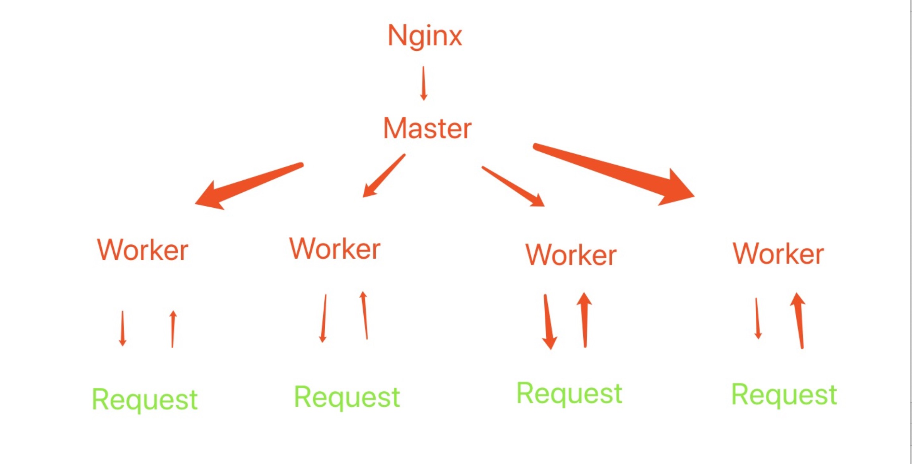

## 了解Nginx基本特性及配置
Nginx启动后，其实是在80端口启动了socket 服务进行了监听。 <br >

*将从以下 7 个方面归纳Nginx原理和配置*
### 1 Master进程的作用是什么 ？
读取并验证配置文件 nginx.conf. 管理worker进程。 <br >

### 2 Worker 进程作用是什么 ？
每个 worker 进程都维护一个线程，处理链接和请求。 <br >
worker 进程的个数由配置文件决定，可以在配置文件中设置，一般是CPU的个数，在nginx.conf可以看到如下参数： <br >
```
worker_process 4; // 比如占用4个cpu核心
```
Nginx的热部署 **nginx -s reload** <br >
- 方案一： 主进程 master 推送给 worker 进程更新配置，worker进程收到后更新进程内线程信息 <br >
- 方案二： 修改配置后重新生成新的worker进程，等待旧的worker进程之前的request请求处理结束，kill旧的worker进程，随后的请求改用新的worker进程 <br >
nginx采用了方案二！ <br >

### 3 nginx是如何高效处理请求的 ？
nginx 采用了 Linux 内核的epoll模型，结合事件来驱动，异步的IO，对于请求做到最高效处理。 <br >

### 4 nginx 挂了怎么办 ？

nginx作为入口网关很重要，出现问题是不可接受的几乎~ <br >
解决方案是 nginx + keepalived 高可用. 一种预防nginx挂掉的解决方案 <br >
keepalive 是一种高可用解决方案，防止服务器单点故障，配合 nginx 来实现web服务高可用。 <br >
- 1，请求不是直接给 nginx，应该先给 keepalived （vip 虚拟IP漂移的一些概念~） <br >
- 2， keepalive应该还可以监控Nginx 生命状态，提供用户自定义脚本，定期检查nginx进程状态（健康检查），进行权重变化，从而实现nginx故障切换。(复杂的健康检查，考虑主从优先级、权重，预防脑裂) <br >


*后续会补充*
